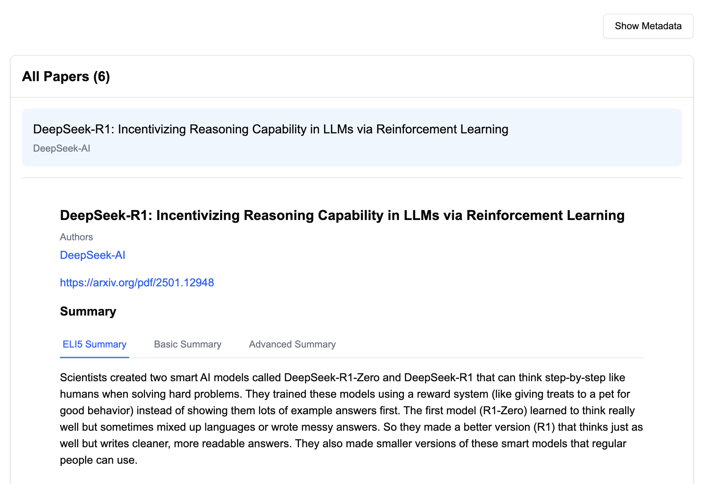

# Paper Pauper: Summarize papers for those in a hurry

Extract useful information from papers (PDFs) and visualize quickly!



See this example: [link](https://curator.bespokelabs.ai/datasets/26d4adb10ab6445687b085bd28f5aec0?appId=3fb0753708f042718c36775d92b9fa71)

### Installation and running:
```shell
python -m venv .venv
source .venv/bin/activate
pip install -r requirements.txt
python summarize.py
```

### PDF parsing
I am using [aryn](https://www.aryn.ai/) to extract markdown from pdfs, and you will need an API key. Nominal usage should be free, but you can plug other parsers you are familiar with, in `get_content.py`.

### Information extraction using Curator
I am using [curator](https://github.com/bespokelabsai/curator) to 
extract the data. It is fast, free, and feature-rich for 
structured data extraction and setting up extraction pipelines.

I am using Claude Sonnet 4 to extract summaries, insights, concepts etc. 
You can look at the pydantic objects in `summarize.py` to 
understand what gets extracted. 
You can change these, but the visualization will break a bit (more on this below).
You can also easily switch to other LLMs in `summarize.py` and even use [batch mode to lower the cost](https://docs.bespokelabs.ai/bespoke-curator/save-usdusdusd-on-llm-inference).


Please note:
* Caching is enabled by default. So if the prompt and/or the input doesn't change, the output is served from the cache. This is great if you want to add more pdfs, and you won't need spend $$$ summarizing the ones that have been already processed.
* If you want to disable caching, you can set the environment variable `CURATOR_DISABLE_CACHE=1`.


### Curator viewer
This uses curator viewer to stream the data and visualize it.
You can disable it by not setting `CURATOR_VIEWER` (this is enabled by default in the .env file which is checked into the repo; please don't put other sensitive keys and share widely).

You can also set the BESPOKE_API_KEY from https://curator.bespokelabs.ai/home/keys, so you can track the data on curator console and the costs.

#### Data and app
Curator extracts the data, and uploads to the viewer. The default data is in a URL like this: https://curator.bespokelabs.ai/datasets/26d4adb10ab6445687b085bd28f5aec0

From there, I have created an app for this data (and all data that looks like this!), and this app can be used by anyone to instantly transform the dull looking json (in this particular format) into a rich visualization. So the URL is https://curator.bespokelabs.ai/datasets/26d4adb10ab6445687b085bd28f5aec0?appId=3fb0753708f042718c36775d92b9fa71

If you are interested in about creating custom visualizations or want to change what's getting extracted and visualized, please contact me (mahesh at bespokelabs.ai).
